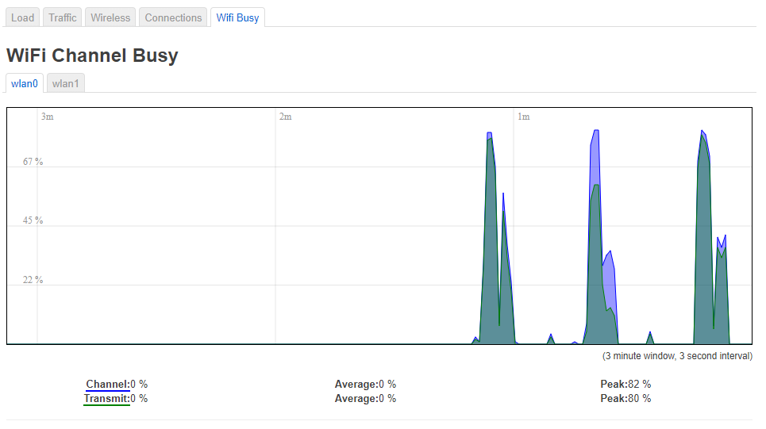

# Realtime wifi % busy graph for OpenWRT

This measures each wifi channel's usage, including from other APs on the same channel.



## To install:
* put wifibusy as /usr/sbin/wifibusy, mode 755
* put wifibusy-config as /etc/config/wifibusy
* put wifibusy-init as /etc/init.d/wifibusy, mode 755
* put wifibusy.htm as /usr/lib/lua/luci/view/admin_status/wifibusy.htm
* put wifibusy.svg as /www/luci-static/resources/wifibusy.svg
* put wifibusy.lua as /usr/lib/lua/luci/controller/wifibusy.lua

You might need to clear your luci cache: `rm -rf /tmp/luci-*cache*`

## Enable polling:

```
/etc/init.d/wifibusy enable
/etc/init.d/wifibusy start
```

## How it works
/usr/sbin/wifibusy runs in the background and polls the configured interfaces every 3 seconds

It creates json arrays for each interface in `/tmp/lib/wifibusy/*`

The web browser polls for that data and graphs it
